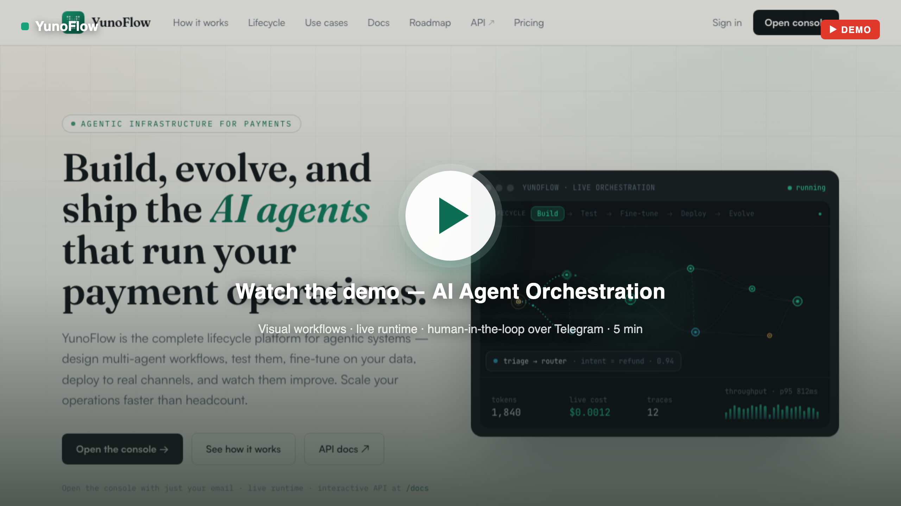
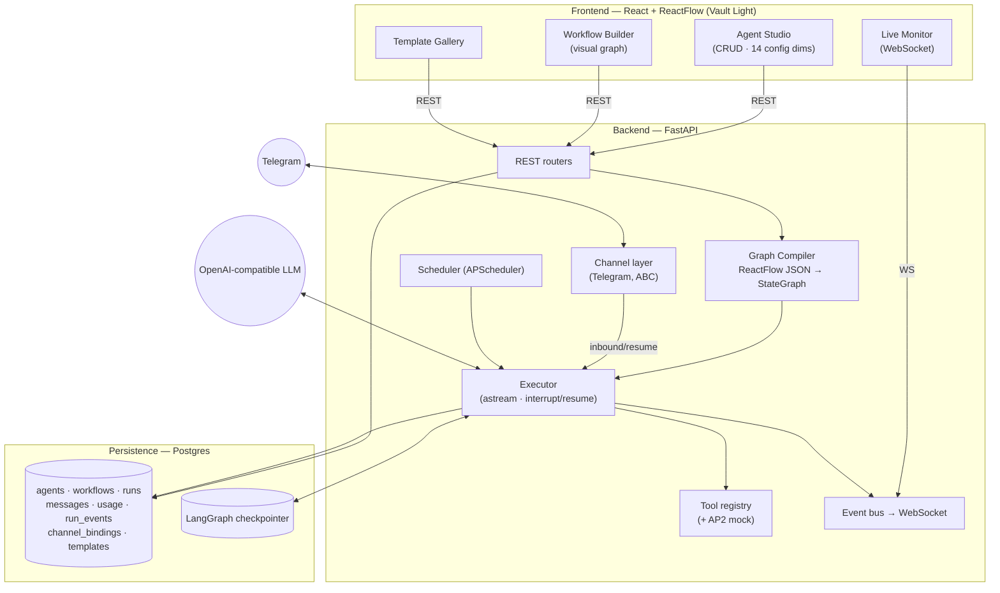

# YunoFlow — AI Agent Orchestration Platform

> Submission for the Yuno AI Engineer Challenge.
> Create AI agents, configure them across **14 dimensions**, connect them into
> collaborative workflows on a **real LangGraph runtime**, pause for **human
> approval** over **Telegram** or the console, and watch every token and cost
> stream **live**. Runs fully local with one command — or self-hosted via Docker.

**▶ Live demo:** **https://yunoflow.vercel.app** (frontend on Vercel) →
backend at **https://138.199.238.92.sslip.io** (Docker on a VM, HTTPS via Caddy,
data on **Supabase** Postgres). Enter any email to open the console — no password.
**API docs (OpenAPI/Swagger):** https://138.199.238.92.sslip.io/docs ·
**Roadmap & Design decisions:** in the landing nav.

A user draws a workflow on a canvas → it compiles to an executable graph → agents
run, call real tools, hand off to each other, and **pause for a human** when a
workflow includes an approval step → every message, token and cost streams to a
live monitor.

---

## 🎥 Demo video

[](https://www.loom.com/share/8459a66f49d5488884233098407f2fad)

▶ **[Watch the 5-minute walkthrough on Loom](https://www.loom.com/share/8459a66f49d5488884233098407f2fad)** — landing tour, templates, a live multi-agent run, and the **human-in-the-loop refund approval over Telegram**.

---

## What you'll see

Templates → instantiate **Refund Approval (Human-in-the-loop)** → a triage agent
summarizes the request → the run **pauses at a human node** (`waiting_human`) →
approve it inline in the console *or* by replying in Telegram → the run resumes
from its checkpoint and a refund agent completes it. The live monitor streams
`run_started → node_enter → agent_message → token_usage → interrupt → run_completed`,
highlighting the running node in real time.

**End-to-end verified** against the real io.net model: instantiate → compiled
graph → run → multi-agent execution with a human pause → resume → completed, with
per-run token/cost persisted and an impact-metrics summary at `/api/metrics/summary`.

---

## Quick start (one command)

**Prerequisites:** Docker + Docker Compose, Node 18+ (the UI is built on the host),
and a `.env` (copy `backend/.env.example`).

```bash
cp backend/.env.example .env        # set LLM_* and (optionally) TELEGRAM_BOT_TOKEN
make up                             # builds the UI, starts db + backend + frontend
```

- **UI:** http://localhost:5173 — open the console by entering any **email** (demo
  gate, no password; the email is saved to a `console_users` table).
- **API:** http://localhost:8000 (`/health`, OpenAPI at `/docs`)
- `make down` to stop. `make seed` reloads templates. `make test` / `make lint`.

`.env` keys (OpenAI-compatible — point at io.net Intelligence / OpenAI / OpenRouter / local):

```
LLM_BASE_URL=...   LLM_API_KEY=...   LLM_MODEL=...
TELEGRAM_BOT_TOKEN=        # blank disables Telegram; the UI + internal runs still work
```

> The UI is built on the host (`make up` runs `npm run build`) and served by an
> nginx container that also proxies `/api` (REST + WebSocket) to the backend.
> SQLite is supported as a no-Docker fallback (see `backend/.env.example`).

---

## Architecture

Three layers with explicit boundaries (UI ⟷ runtime ⟷ persistence):



**The Compiler** is the heart: a ReactFlow node becomes a graph node, an edge
becomes an edge, an edge out of a `condition` node becomes a conditional edge
(`add_conditional_edges` keyed on `state['route']`), and a back-edge becomes a
native cycle (feedback loop). See `backend/app/runtime/compiler.py`.

### Runtime choice — why LangGraph

The platform's hardest requirement — *a visual workflow builder with conditions
and feedback loops driving a real runtime* — is structurally a directed graph
with cycles, which is exactly LangGraph's `StateGraph`. That let us map the
ReactFlow canvas onto the engine one-to-one, and inherit **persistence**
(checkpointers), **message-history replay**, **token-level streaming** for live
monitoring, and **`interrupt()`/resume** for human-in-the-loop as built-in
capabilities rather than bespoke code. Full comparison vs AutoGen and CrewAI:
[`tech-docs/framework.md`](tech-docs/framework.md).

### Protocol map

| Edge | Standard | Status |
|---|---|---|
| Agent ↔ Agent | LangGraph shared state + **A2A** Agent Cards | state: built · A2A discovery: built (`/api/a2a/agents`) · A2A task exec: future |
| Agent ↔ Human (approval) | **`human` node** → `interrupt()`/resume via console **or Telegram** | built |
| Agent ↔ Human (chat) | **Telegram** (aiogram long-poll) | built |
| Agent ↔ UI (events) | custom WebSocket (*AG-UI*-shaped) | built |
| Agent ↔ Tools | internal registry (*MCP*) | built · MCP: future |
| Agent ↔ Payments | **AP2**-style mandates (mock) | built (mock) |

---

## Project structure

```
backend/            FastAPI + LangGraph + SQLAlchemy + aiogram
  app/api/          routers: agents, workflows, runs, templates, channels, tools, ws, health
  app/runtime/      compiler, executor, builder, events, checkpointer, nodes/
  app/tools/        registry + builtins + AP2 payment_mock + guardrails
  app/channels/     Channel ABC, telegram, router, manager
  app/scheduling/   APScheduler
  app/observability/ MLflow autolog (flagged)
  app/templates/    6 seed templates + KB
  app/models/ schemas/ tests/
frontend/           React + TS + Vite + ReactFlow + Tailwind ("Vault Light")
tech-docs/          design spec, framework decision, frontend design + mockup
docker-compose.yml  db + backend + frontend (+ optional mlflow profile)
```

---

## Agent configuration (14 dimensions)

`name · role · system_prompt · model · temperature · top_p · tools · channels ·
schedule_cron · memory{mode,window_size,summarize} · skills · interaction_rules ·
guardrails{max_steps,max_tokens,max_cost_usd,allowed_tools} · personality{tone,traits}`

Guardrails are enforced at runtime: `max_steps` → graph recursion limit;
`max_tokens`/`max_cost_usd` → the executor finalizes a run as `failed` when
exceeded; `allowed_tools` filters what an agent can call.

## Workflow templates (6)

> The platform is **general-purpose** — payments theming reflects Yuno's domain, not a
> requirement. Templates #2 and #6 are deliberately non-payments to show that.

1. **Payments Support Triage** — triage → condition(refund | info) → refund
   specialist (AP2 refund tools) / FAQ agent. Conditions + Telegram.
2. **Research → Draft → Review** *(non-payments)* — researcher → writer → critic,
   looping back to the writer until approved (feedback loop / cycle).
3. **Payment Authorization (AP2)** — risk-assess → approve / step-up / decline,
   executing via AP2 intent/cart/payment mandates.
4. **Refund Approval (Human-in-the-loop)** — triage summarizes the request → a
   `human` node **pauses for approval** (console or Telegram) → refund agent issues
   it. The clearest demo of `interrupt()`/resume over a real channel.
5. **Dispute Investigator (DeepAgent)** — a `deepagents` node that plans, calls
   tools, and spawns sub-agents to investigate a disputed charge and recommend.
6. **Lead Qualification & Routing** *(non-payments)* — enrich an inbound lead →
   an LLM scores hot/warm/cold → routes to outreach / nurture / archive. Shows the
   runtime is domain-agnostic, not payments-only.

---

## Extending the platform

**Add a tool** — write a function with a docstring, decorate it, done:

```python
# backend/app/tools/builtins.py
@register("my_tool", side_effecting=True)
async def my_tool(arg: str) -> str:
    """What it does (the model reads this)."""
    ...
```
It appears in `GET /api/tools` and the UI tool picker automatically.

**Add a channel** — subclass `Channel` (`start/stop/send`) in
`backend/app/channels/`, register it in `manager.py`'s factory. No changes to the
router or executor — the binding's `channel_type` selects the adapter.

**Add a workflow template** — add a definition to
`backend/app/templates/seed.py` (agent nodes carry an `agent_spec`); `make seed`
loads it. Instantiating creates the agents and a runnable workflow.

---

## API (selected)

| Method | Path | Purpose |
|---|---|---|
| `POST` | `/api/auth/login` | email-only console gate → `{token, user}` |
| `POST/GET/PATCH/DELETE` | `/api/agents` | agent CRUD |
| `POST` | `/api/workflows/{id}/validate` | dry-run compile (structural errors) |
| `POST` | `/api/runs` | start a run (background) |
| `POST` | `/api/runs/{id}/resume` | resume an interrupted run (human approval) |
| `GET` | `/api/runs/{id}/messages` `…/usage` `…/events` | history, token/cost, monitor events |
| `WS` | `/api/ws/runs/{id}` | live monitor (replay + stream) |
| `GET` | `/api/metrics/summary` | impact metrics (dimensions, completion rate, tokens) |
| `GET` | `/api/templates`, `POST …/instantiate` | templates |
| `POST/GET/DELETE` | `/api/channels` | connect/list/remove a Telegram bot binding |
| `GET` | `/api/tools`, `/api/channels/status` | tools, channel status |
| `GET` | `/api/a2a/agents`, `…/agents/{id}` | A2A Agent Card discovery |

WebSocket event envelope: `{seq, run_id, ts, type, data}` where `type ∈
{run_started, node_enter, node_exit, agent_message, tool_call, token_usage,
interrupt, run_completed, error}` (`node_enter` drives the live running-node highlight).

---

## Testing

`make test` — pytest covering the critical paths: **agent creation** (14-dim
round-trip), **workflow execution** + **interrupt/resume**, **message delivery**
(channel inbound → agent → outbound), the **Compiler** (linear, conditional both
branches, cycle, validation), **guardrails** (recursion + budget), and the
**event stream** (envelope shape, seq monotonicity, replay). LLM calls are mocked
for determinism. The frontend adds Vitest unit tests for the graph layout logic.
`make lint` runs ruff.

---

## Future directions (designed, not built)

**Built (bonus, beyond the brief), all gated/flagged so the core stays lean:**
**DeepAgents** — a planning + sub-agent + filesystem node (the Dispute
Investigator template); **A2A** Agent Card discovery (`/api/a2a/agents`) making
agents A2A-addressable; **DBOS** durable execution (`FEATURE_DBOS` + `[dbos]`
extra — Postgres-native durable workflows + a scheduled sweep, verified
launchable); **MLflow** deep tracing (`FEATURE_MLFLOW` + `[obs]` extra + compose
profile).

**Designed, not shipped** (scoped out to protect the core, documented for
credibility): full **A2A** JSON-RPC task execution (the a2a-sdk 1.x runtime is
Protobuf-backed), **AG-UI** (standardize the event stream), **MCP** (tool
exposure), full **AP2** rails, and **Temporal/Hatchet** at scale. See
[`tech-docs/backend-implementation-plan.md`](tech-docs/backend-implementation-plan.md).
